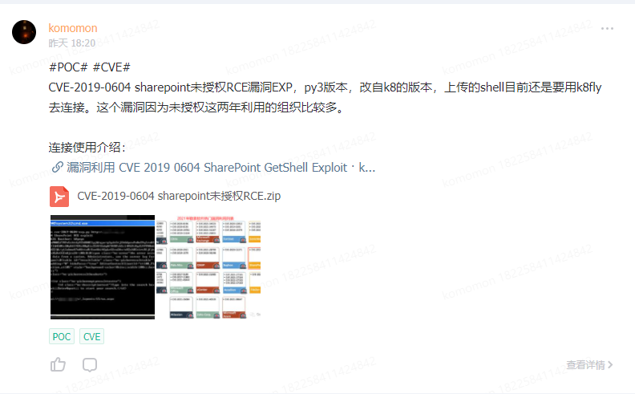
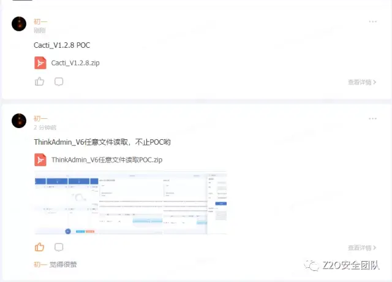

# ip2domain

通过ssl证书，批量ip反查域名工具。

## Usage

```
usage:
            python3 ip2domain.py -f file.txt


optional arguments:
  -h, --help            show this help message and exit
  -f FILE, --file FILE  the url file
  -o OUTPUT, --output OUTPUT
                        the result file
  -t THREADS, --thread THREADS
                        Threads num, defalut 10
```

文件内容格式：

```
121.40.43.188
121.40.43.188
121.40.43.189:8080
www.cnblogs.com
```


默认结果存储到当前时间的txt文件中


## 一起交流

感兴趣的可以关注 **Z2O安全攻防** 公众号回复“**加群**”，添加Z2OBot 小K自动拉你加入**Z2O安全攻防交流群**分享更多好东西。


团队建立了知识星球，不定时更新最新漏洞复现，手把手教你，同时不定时更新POC、内外网渗透测试骚操作。感兴趣的可以加一下。






**欢迎star:star: O(∩_∩)O**