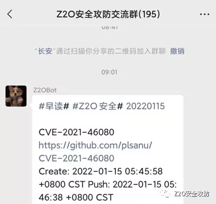

## Mytools

自己工作中用python编写的各种脚本

从名字基本可以判断出类型，多线程的都使用了生产者消费者模型，对于想开发工具的小伙伴可以提供一个参考。

**免责声明：**

利用此文所提供的信息而造成的任何直接或者间接的后果及损失，均由使用者本人负责，文章作者不为此承担任何责任。

只供对已授权的目标使用测试，对未授权目标的测试作者不承担责任，均由使用本人自行承担。

感兴趣的可以关注 **Z2O安全攻防** 公众号回复“**加群**”，添加Z2OBot 小K自动拉你加入**Z2O安全攻防交流群**分享更多好东西。

团队建立了知识星球，不定时更新最新漏洞复现，手把手教你，同时不定时更新POC、内外网渗透测试骚操作。感兴趣的可以加一下。

欢迎⭐ 😁